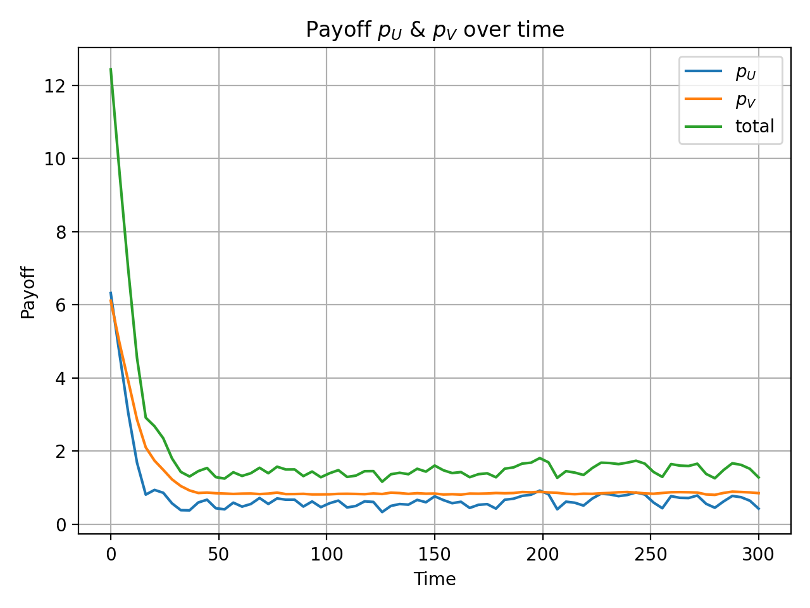

.. _Clarifications:

Clarifications
====================

This section provides clarifications for potentially confusing usages and parameters.

.. _Clarification_demo_model:

Demo Model
---------------

Many clarifications are based on examples. We will use our :ref:`demo model<demo_params>` in below. You can get a copy of it by ``piegy.simulation.demo_model``.

.. code-block:: python

    from piegy import simulation

    mod = simulation.demo_model()
    simulation.run(mod)

.. _interval:

``interval``
------------

.. line-block::
    Parameter in: (``piegy.`` omitted)
    ``analysis.check_convergence``, ``test_var.var_convergence1``, ``test_var.var_convergence2``, ``figures``

``interval`` essentially means: take average over some data points.
It denotes the length of a "data interval". We take the average value over every such interval of data points, and work with these average values to smooth out local randomness.

For example, in our :ref:`demo model<demo_params>`, if we make a U, V payoff - time plot without taking any average (i.e., ``interval = 1``), the figure is:

    pi_dyna with interval = 1

.. line-block:: 
    Notice the high local fluctuations. We can smooth out these fluctuations by ``interval``, say set it to 40:

    pi_dyna with interval = 40

Now it looks much cleaner. 
You may notice the x-range is reduced to around 80. That is exactly because we are taking averages: every 40 original data points give a new "average point".

.. _compress_data:

``compress_data`` and ``compress_itv``
--------------------------------------------

* ``compress_data`` is a class method of ``piegy.simulation.model``. 
* ``compress_itv``:
    * parameter for ``compress_data``.
    * A ``piegy.simulation.model`` object also has ``compress_itv`` has a variable. Stores current ratio of data reduction, initialized as 1 and updated by ``compress_data``.

``compress_data`` is an effort to reduce data size by saving only average values rather than every data point.
For example, let's look at how many numbers are contained in ``sim`` (our demo model, see parameters at :ref:`Typical Params<Typical_Params>`)

#. We have ``N * M * 12`` input parameters (initial population, matrices, patch variables, etc.)
#. As for the data generated during simulation, there ``N * M * maxtime / record_itv`` for U's population. That is :math:`10 \cdot 10 \cdot 3000 = 3 \cdot 10^5` in our case.
#. And similarly for V population, U and V payoff.
#. So we will be saving about :math:`12 \cdot 10^6` numbers in total --- that's a lot!

There is indeed a way to reduce data at the expense of losing accuracy: take average over every some interval of data points and save these average values. This is done by ``compress_data``.
For example, by calling:

.. code-block:: python

    mod.compress_data(10)

it goes through every patch and takes average over every 10 original data points, store the average, then move on to the next 10.
The change is in-place, i.e., directly modifies ``sim``.

Then for ``mod.U`` (U population), we used to store ``10 * 10 * 3000`` values, and now its size is reduced to ``10 * 10 * 300``. 
In terms of the total number of data points, we only need to save :math:`12 \cdot 10^5` numbers now, reduced by 10 times.

However, the actual size shown in file system is probably not divided by 10. That may be due to some ``json`` behaviors (data are stored in json format).

The size reduction comes at the expense of:

* The original data are lost; we only have average values now.
* The new data become coarser as we use larger ``compress_itv``.

You can call ``compress_data`` repeatedly, and data will become coarser and coarser as well. For example, calling ``mod.compress_data(10)`` again takes average over every :math:`10 \cdot 10` points; essentially the same as ``mod.compress_data(100)``.

You can check the current reduction ratio by printing out ``compress_itv`` variable of ``sim``:

.. code-block:: python

    print(mod.compress_itv)

.. _interval_compress_itv:

Considerations about ``interval`` and ``compress_itv``
-------------------------------------------------------

* Here ``interval`` refers to parameters of functions in ``piegy.figures``, ``piegy.analysis``, ``piegy.test_var``.
* ``compress_itv`` refers to variable of a ``piegy.simulation.model`` object, which records ratio of data reduction.

There might be considerations whether ``interval`` and ``compress_itv`` would have conflicts. The answer is **No**.

Our codes are specifically designed to accommodate both two intervals, in the following way:

#. Say ``interval = 10``.
#. If ``compress_itv`` is 1, then make plots / perform other analysis as they were: take average over every 10 data points and proceed.
#. If ``compress_itv`` is not 1, scale ``interval`` by:

    .. code-block:: python

        interval = int(interval / compress_itv)

    and then proceed. So that we will still be taking average over the same number of data points (in terms of the original data).
#. If ``compress_itv`` is larger than ``interval``, the above code would result in the new ``interval`` being 0. We then set it to 1 and print a warning message: data is coarser than the expected interval.

.. _start_end:

``start`` and ``end``
---------------------

.. line-block::
    Parameter in: (``piegy.`` omitted)
    ``analysis.check_convergence``, ``figures``, ``test_var``

.. line-block::
    The ``start`` and ``end`` parameters point to some proportion of maxtime.
    They are combined together to specify a time interval, with ``start`` being the lower bound and ``end`` being upper bound.

    For example, for ``maxtime`` = 300 in the our :ref:`demo model<demo_params>`, ``start`` = 0.9 points to the time point at 300 * 0.9 = 270, and ``end`` = 1.0 points to 300 * 1.0 = 300.
    
    We can then specify a time interval of :math:`(270, 300)` by combining ``start`` and ``end``, essentially the last 10% of time.

.. _convergence_fluc:

Convergence and ``fluc``
------------------------

.. line-block::
    ``fluc`` is a param in: (``piegy.`` omitted)
    ``analysis.check_convergence``, ``test_var.var_convergence1``, ``test_var.var_convergence2``

.. line-block::
    We check convergence by looking at some last-proportion of time and check whether the fluctuation of both U and V population is less than the ``fluc`` threshold.

    The implementation is:

#. For U population:
#. Get average data based on the ``interval`` param (all 3 functions have this paramter).
#. Get the max and min of the average data.
#. Fluctuation of U is then given by :math:`\frac{(max - min)}{min}`. Similarly for V. 
#. Consider the result convergent if both fluctuations are less than ``fluc``.

