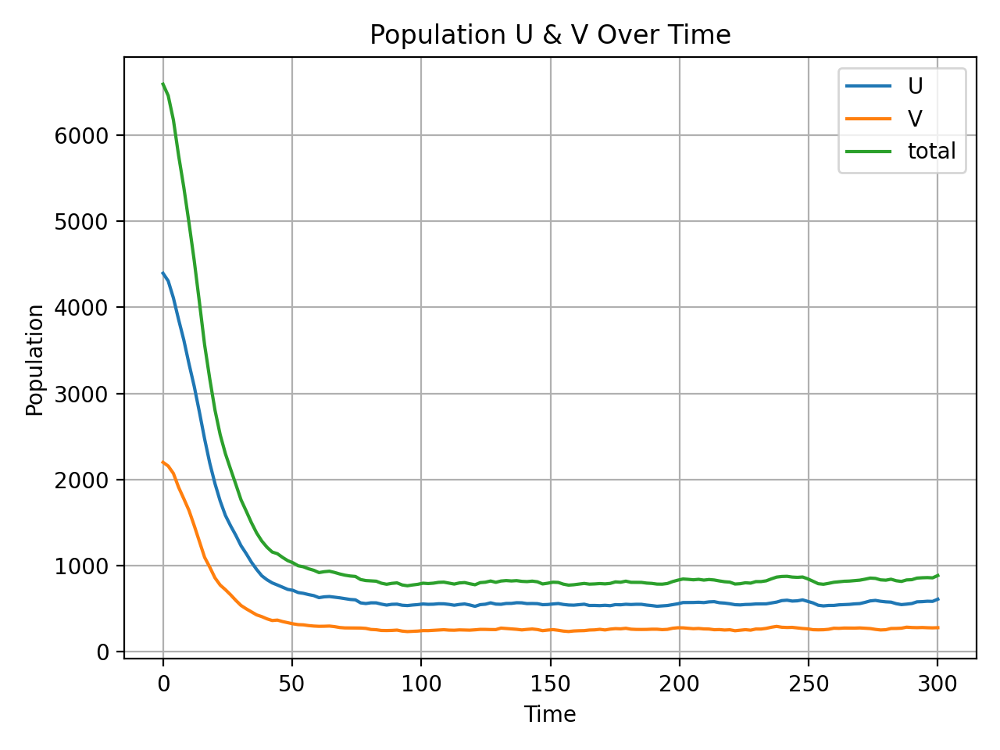

.. _Typical_Params:

Typical Parameters
====================

This section includes some typical parameters we used for simulation. They are just for reference and to get you started --- try anything!

.. _demo_params:

Parameters in Demo Model
----------------------------------------

Most of the examples in our ``piegy`` documentation use the same model. We list out its parameters here. 

You can also get a copy of it rather conveniently by :ref:`piegy.model.demo_model<demo_model>` function.

.. code-block:: python

    import piegy.model as model  # import it if you haven't

    N = 10                  # Number of rows
    M = 10                  # Number of cols
    maxtime = 300           # how long you want the model to run
    record_itv = 0.1        # how often to record data.
    sim_time = 1            # repeat simulation to reduce randomness
    boundary = True         # boundary condition.

    # initial population for the N x M patches.
    I = [[[44, 22] for _ in range(M)] for _ in range(N)]
    
    # flattened payoff matrices, total resource is 0.4, cost of fighting is 0.1
    X = [[[-0.1, 0.4, 0, 0.2] for _ in range(M)] for _ in range(N)]
    
    # patch variables
    P = [[[0.5, 0.5, 200, 200, 0.001, 0.001] for _ in range(M)] for _ in range(N)]

    print_pct = 5           # print progress
    seed = 36               # seed for random number generation
    UV_dtype = 'float32'    # data type for population
    pi_dtype = 'float64'    # data type for payoff

    # create a simulation object
    sim = model.simulation(N, M, maxtime, record_itv, sim_time, boundary, I, X, P, 
                            print_pct = print_pct, seed = seed, UV_dtype = UV_dtype, pi_dtype = pi_dtype)

Quick look of population dynamics and final distribution:

    Population Dynamics

.. figure:: images/demo_model/U_hmap.png

    Final Distribution of U Population 

.. figure:: images/demo_model/V_hmap.png

    Final Distribution of V Population 

This model has the following properties:

#. The 10 x 10 spatial dimension is large enough for sufficient migration but not exceedingly large in terms of runtime.
#. The uniform payoff matrices follow a classical predator-prey setting: 
    * The cost of fighting among predators is 0.1
    * The total resource is 0.4
    * Two predators fight and each gain -0.1 payoff.
    * Predator eats prey and gain 0.4 payoff, while prey gain 0 payoff.
    * Preys share the resource equally and each gain 0.2 payoff.
#. The ``[44, 22]`` initial population are exactly the expected equilibrium population, assuming no migration and no spatial structure (the whole space is 1 patch).
#. It demonstrates some interesting phenomena:
    * In terms of distribution, the model starts from uniform state but ended with a highly clustering distribution.
    * As for population, the actual equilibrium population is much smaller than expected (44, 22 per patch).

However, you may notice we run the simulation only once (``sim_time = 1``), and this may result in high randomness. 
That's absolutely correct. For real simulations, we recommend repeat the simulation and check the final distribution.

