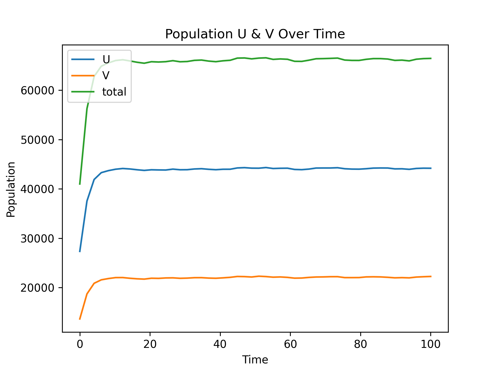
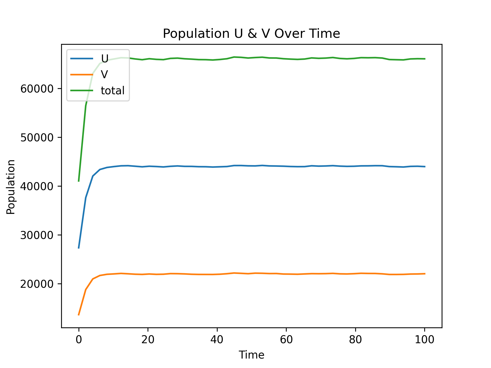

.. _analysis:

piegy.analysis
====================

This module contains analytic tools for simulation results.

.. py:function:: analysis.check_convergence(mod, interval = 20, start = 0.8, fluc = 0.05)

    .. line-block::
        Check whether simulation has reached convergence.

        Actually performs a "Cauchy check" since we do not know the limit. i.e., whether the fluctuation of population after some specified time is small enough.
        However, we know being Cauchy indicates convergent in real numbers. So this check works in terms of math.

        See implementation details at :ref:`Clarifications-Convergence<convergence_fluc>`.

    :param mod: where the parameters of the model and data are stored. 
    :type mod: ``piegy.simulation.model`` object

    :param interval: takes average over some number of data points to smooth data.
    :type interval: int

    :param start: defines a time point by how much percentage of maxtime. Calculate fluctuation of U, V population after this point.
    :type start: float

    :param fluc: threshold of fluctuation. Check whether max fluctuation of U, V population after ``start`` proportion of time is less than this threshold.
    :type fluc: float

    :return: whether fluctuation after ``start`` proportion of time is less than ``fluc`` threshold.
    :rtype: bool

|

.. py:function:: analysis.combine_mod(mod1, mod2, force_combine = False)

    .. line-block::
        Combines the simulation results in two ``piegy.simulation.model`` objects. 
        Intended usage: if the fluctuation of one simulation is too large, you can run another simulation and then take average of the two.

        Raises error if ``mod1`` and ``mod2`` have different ``N``, ``M``, ``maxtime``, ``record_itv``, ``boundary``, ``init_popu``, ``matrices``, or ``patch_params`` (can't combine two different models).
        Raises error if ``mod1`` and ``mod2`` have the same seed: can't reduce randomness if models used the same random seed.

        However, if you do wish to combine the two models any way and bypass the parameter checks above, set ``force_combine = True``.

    :param mod1: the first simulation.
    :type mod: ``piegy.simulation.model`` object

    :param mod2: the second simulation.
    :type mod: ``piegy.simulation.model`` object

    :param force_combine: bypass all parameter checks and force combining the results of the two models.
    :type force_combine: bool

    :return: a third model whose parameters are the same as ``mod1`` and ``mod2``, but data are the weighted average of the two (wieghted by the number of rounds each simulation ran)
    :rtype: ``piegy.simulation.model`` object

|

Examples
----------

Here are some usage examples of the ``piegy.analysis`` module.

We will use the following modules in the examples:

.. code-block:: python

    from piegy import simulation, figures, analysis
    import numpy as np

Let's then run our demo model and then see how to analyze the result using the ``analysis`` module. We increase ``sim_time`` to 10 to reduce stochasticity. 
And for demostration purposes, the initial populatoin is also modified so that the simulation does not start from the equilibrium state.

.. code-block:: python

    mod = simulation.demo_model()
    mod.sim_time = 5
    simulation.run(mod)

* **check_convergence**

A familiar way to check convergence is by plotting population dynamics and look at the curves. ``figures.UV_dyna(mod)`` gives the following figure:

    Population Dynamics with ``sim_time = 10``

We can see it roughly converges, but some small fluctuations do exist due to stochasticity.

However, as we run more simulations and have lots of results, it is inconvenient to check convergence manually. Here we provide a automatic approach by ``piegy.analysis.check_convergence`` function:

.. code-block:: python

    print(analysis.check_convergence(mod, interval = 20, start = 0.8, fluc = 0.01))  # strict requirements
    print(analysis.check_convergence(mod, interval = 20, start = 0.8, fluc = 0.05))  # relax a bit

The first line prints ``False`` and the second prints ``True``. How to interpret?

#. Passing the second test means the simulation results do converge in some sense: there exists some relaxed condition under which the result is considered convergent.
#. Failing the rigorous test indicates existence of local fluctuations: the result is not smooth and stable enough.

And that's the power of ``check_convergence`` function. It automatically checks whether the result converges, and converges to what extent.

In terms of actual usage, we recommend the following:

#. Say you have lots of simulation results and want to know which ones didn't converge.
#. Set up a rigorous test and a relaxed test, and check each of the results with the two tests.
#. This should filter out many results that are already stable.
#. Then manually check the remaining uncertain ones by plotting population dynamics.

But what about the results that didn't converge? We provide an approach to possibly re-use these results rather than simply discarding them.

* **combine_mod**

First let us make a copy of ``mod`` without data, just the parameters. You can see ``copy`` method at :ref:`piegy.simulation.model <simulation>`.

.. code-block:: python

    mod2 = mod.copy(copy_data = False)

Then change the seed of sim2, set to either ``None`` or a different seed, and run the simulation on ``mod2``:

.. code-block:: python

    mod2.set_seed(42)  # a different seed or None
    simulation.run(mod2)

Now we have two simulation results, one in ``mod`` and the other one in ``mod2``. Both of them have ``sim_time = 10``, i.e., the simulation was repeated 10 times. 
But since they have different seeds (or ``None``), we can take average of two simulations and obtain a new result, as if it was ran 20 times:

.. code-block:: python

    mod3 = analysis.combine_mod(mod, mod2)

``mod3`` has a much more stable result:

    Population Dynamics of ``mod``, ``mod2`` Combined

However, if you try the above convergence tests again, you would note ``mod3`` still fails the strict one. A larger number of repetitions such as ``sim_time = 20`` may pass the test.

