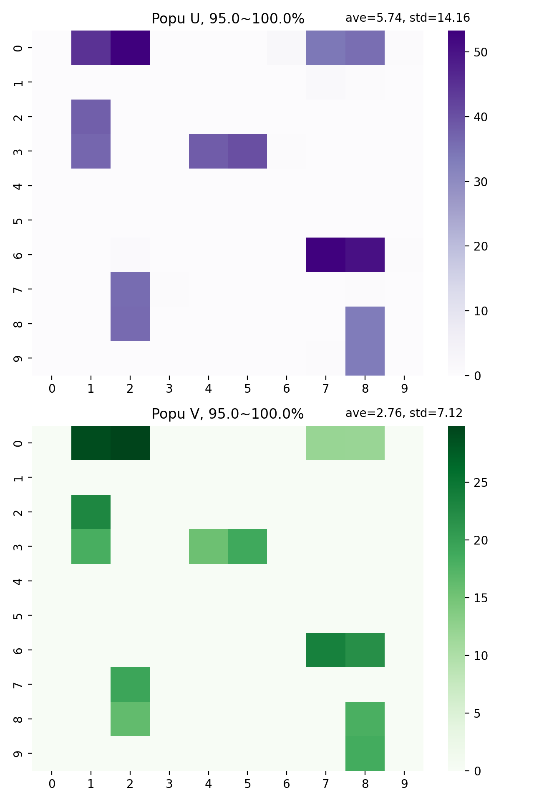
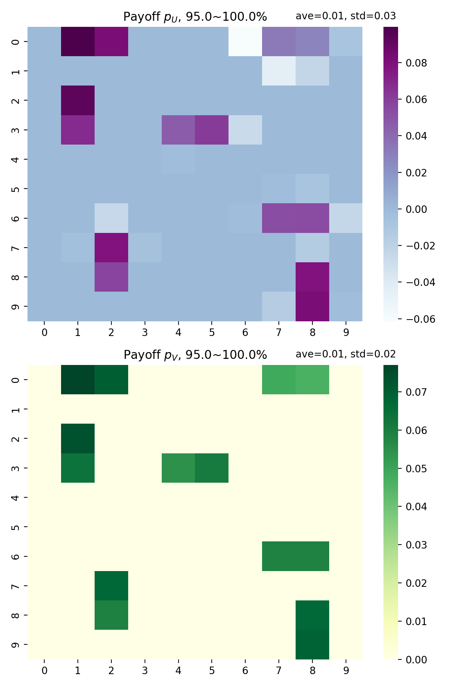

.. _figures:

piegy.figures
=============

..  Example: https://www.sphinx-doc.org/en/master/tutorial/describing-code.html
    Grammar: https://www.sphinx-doc.org/en/master/usage/domains/python.html

This section describes the ``figures`` module of our package: make figures to visualize simulation results.
We reserved the word "plot" for matplotlib plots, and use "figures" as the name of the module instead.

Dynamics Figures
---------------------------------

This subsection contains the functions for plotting dynamics of certain values, i.e., how the values change over time, from time t = 0 to maxtime.

.. py:function:: figures.UV_dyna(mod, ax = None, interval = 20, grid = True)

    .. line-block::
        Plot how U, V, and total population change over time.

    :param mod: where the parameters of the model and data are stored. 
    :type mod: ``piegy.simulation.model`` object

    :param ax: matplotlib axes to plot upon. A new axes will be created if ``None`` is given.
    :type ax: matplotlib axes

    :param interval: the function takes average over every ``interval`` many data points and makes plot. 
                    Used to smooth curves. See details at :ref:`Clarifications-interval<interval>`
    :type interval: int

    :param grid: whether to add grid lines to axes.
    :type grid: bool

    :return: a plot of the change of population over time.
    :rtype: matplotlib axes.

|

.. py:function:: figures.pi_dyna(mod, ax = None, interval = 20, grid = True)

    .. line-block::
        Plot change of U, V, and total payoff over time.

    :param mod: where the parameters of the model and data are stored. 
    :type mod: ``piegy.simulation.model`` object

    :param ax: matplotlib axes to plot upon. A new axes will be created if ``None`` is given.
    :type ax: matplotlib axes

    :param interval: the function takes average over every ``interval`` many data points and makes plot. 
                    Used to smooth curves. See details at :ref:`Clarifications-interval<interval>`
    :type interval: int

    :param grid: whether to add grid lines to axes.
    :type grid: bool

    :return: a plot of the change of population over time.
    :rtype: matplotlib axes.

|

.. py:function:: figures.UV_std(mod, ax = None, interval = 20, grid = True)

    .. line-block::
        Plot change of standard deviation of U, V population over time.

    :param mod: where the parameters of the model and data are stored. 
    :type mod: ``piegy.simulation.model`` object

    :param ax: matplotlib axes to plot upon. A new axes will be created if ``None`` is given.
    :type ax: matplotlib axes

    :param interval: the function takes average over every ``interval`` many data points and makes plot. 
                    Used to smooth curves. See details at :ref:`Clarifications-interval<interval>`
    :type interval: int

    :param grid: whether to add grid lines to axes.
    :type grid: bool

    :return: a plot of the change of population over time.
    :rtype: matplotlib axes.

|

.. py:function:: figures.pi_std(mod, ax = None, interval = 20, grid = True)

    .. line-block::
        Plot change of standard deviation of U, V payoff over time.

    :param mod: where the parameters of the model and data are stored. 
    :type mod: ``piegy.simulation.model`` object

    :param ax: matplotlib axes to plot upon. A new axes will be created if ``None`` is given.
    :type ax: matplotlib axes

    :param interval: the function takes average over every ``interval`` many data points and makes plot. 
                    Used to smooth curves. See details at :ref:`Clarifications-interval<interval>`
    :type interval: int

    :param grid: whether to add grid lines to axes.
    :type grid: bool

    :return: a plot of the change of population over time.
    :rtype: matplotlib axes.

|

.. py:function:: figures.UV_hist(mod, ax_U = None, ax_V = None, U_color = 'purple', V_color = 'green', start = 0.95, end = 1.0)

    Make two histograms of U, V average population density in a specified time interval.
    Sometimes it may not be shown in density plots due to matplotlib features.

    :param mod: where the parameters of the model and data are stored. 
    :type mod: ``piegy.simulation.model`` object

    :param ax_U: matplotlib axes to plot the histogram of U upon. A new axes will be created if ``None`` is given.
    :type ax_U: matplotlib axes

    :param ax_V: matplotlib axes to plot the histogram of V upon. A new axes will be created if ``None`` is given.
    :type ax_V: matplotlib axes

    :param U_color: color for the histograms, using regular matplotlib colors.
    :type U_color: str

    :param V_color: similar to ``U_color``.
    :type V_color: str

    :param start: start of the time interval. Default 0.9 means the interval starts from 90% of maxtime. 
    :type start: float or int, :math:`\le 1`

    :param end: end of the time interval. Default 1.0 means the interval ends at exactly maxtime. See details of ``start`` and ``end`` at :ref:`Clarifications-start-end<start_end>`.
    :type end: float or int, :math:`\le 1`

    :return: two density histograms for U, V population.
    :rtype: matplotlib axes.

|

.. py:function:: figures.pi_hist(mod, ax_U = None, ax_V = None, U_color = 'purple', V_color = 'green', start = 0.95, end = 1.0)

    Make two histograms of U, V average payoff density in a specified time interval.
    Sometimes it may not be shown in density plots due to matplotlib features.

    :param mod: where the parameters of the model and data are stored. 
    :type mod: ``piegy.simulation.model`` object

    :param ax_U: matplotlib axes to plot the histogram of U payoff upon. A new axes will be created if ``None`` is given.
    :type ax_U: matplotlib axes

    :param ax_V: matplotlib axes to plot the histogram of V payoff upon. A new axes will be created if ``None`` is given.
    :type ax_V: matplotlib axes

    :param U_color: color for the histograms, using regular matplotlib colors.
    :type U_color: str

    :param V_color: similar to ``U_color``.
    :type V_color: str

    :param start: start of the time interval. Default 0.9 means the interval starts from 90% of maxtime. 
    :type start: float or int, :math:`\le 1`

    :param end: end of the time interval. Default 1.0 means the interval ends at exactly maxtime. See details of ``start`` and ``end`` at :ref:`Clarifications-start-end<start_end>`.
    :type end: float or int, :math:`\le 1`

    :return: two density histograms for U, V payoff.
    :rtype: matplotlib axes.

Distribution Figures
----------------------

This subsection contains the distribution functions, i.e., the average distribution of either population or payoff in a specified time interval.

.. _figures_UV_heatmap:

.. py:function:: figures.UV_heatmap(mod, ax_U = None, ax_V = None, U_color = 'Purples', V_color = 'Greens', start = 0.95, end = 1.0, annot = False, fmt = '.3g')

    .. line-block::
        Make two heatmaps for U, V average population distribution in a specified time interval.
        Intended for the 2D spatial setting, where both ``N`` and ``M`` larger than 1. For 1D space, please use :ref:`UV_bar<figures_UV_bar>`.

    :param mod: where the parameters of the model and data are stored. 
    :type mod: ``piegy.simulation.model`` object

    :param ax_U: matplotlib axes to plot the heatmap of U population upon. A new axes will be created if ``None`` is given.
    :type ax_U: matplotlib axes

    :param ax_V: matplotlib axes to plot the heatmap of V population upon. A new axes will be created if ``None`` is given.
    :type ax_V: matplotlib axes

    :param U_color: color to use for U's heatmap. Uses matplotlib color maps.
    :type U_color: str

    :param V_color: similar to ``U_color``.
    :type V_color: str

    :param start: start of the time interval. Default 0.9 means the interval starts from 90% of maxtime. 
    :type start: float or int, :math:`\le 1`

    :param end: end of the time interval. Default 1.0 means the interval ends at exactly maxtime. See details of ``start`` and ``end`` at :ref:`Clarifications-start-end<start_end>`.
    :type end: float or int, :math:`\le 1`
    
    :param annot: add annotations: show the exact population at each patch, passed to ``seaborn.heatmap`` function.
    :type annot: bool

    :param fmt: format of the annotation numbers, passed to ``seaborn.heatmap`` function. ``'.3g'`` is for 3 significant digits. Please set ``annot`` = True first and then use ``fmt``.
    :type fmt: str

    :return: two heatmaps of distribution of U, V population.
    :rtype: matplotlib axes.

|

.. _figures_pi_heatmap:

.. py:function:: figures.pi_heatmap(mod, ax_U = None, ax_V = None, U_color = 'BuPu', V_color = 'YlGn', start = 0.95, end = 1.0, annot = False, fmt = '.3g')

    .. line-block::
        Make two heatmaps for U, V average payoff distribution in a specified time interval.
        Intended for 2D spatial setting, where both ``N`` and ``M`` larger than 1. For 1D space, please use :ref:`pi_bar<figures_pi_bar>`.

        Recommend using different colors for population and payoff to avoid confusion.

    :param mod: where the parameters of the model and data are stored. 
    :type mod: ``piegy.simulation.model`` object

    :param ax_U: matplotlib axes to plot the heatmap of U payoff upon. A new axes will be created if ``None`` is given.
    :type ax_U: matplotlib axes

    :param ax_V: matplotlib axes to plot the heatmap of V payoff upon. A new axes will be created if ``None`` is given.
    :type ax_V: matplotlib axes

    :param U_color: color to use for U's heatmap. Uses matplotlib color maps.
    :type U_color: str

    :param V_color: similar to ``U_color``.
    :type V_color: str

    :param start: start of the time interval. Default 0.9 means the interval starts from 90% of maxtime. 
    :type start: float or int, :math:`\le 1`

    :param end: end of the time interval. Default 1.0 means the interval ends at exactly maxtime. See details of ``start`` and ``end`` at :ref:`Clarifications-start-end<start_end>`.
    :type end: float or int, :math:`\le 1`
    
    :param annot: add annotations: show the exact population at each patch, passed to ``seaborn.heatmap`` function.
    :type annot: bool

    :param fmt: format of the annotation numbers, passed to ``seaborn.heatmap`` function. ``'.3g'`` is for 3 significant digits. Please set ``annot`` = True first and then use ``fmt``.
    :type fmt: str

    :return: two heatmaps of distribution of U, V population.
    :rtype: matplotlib axes.

|

.. _figures_UV_bar:

.. py:function:: figures.UV_bar(mod, ax_U = None, ax_V = None, U_color = 'purple', V_color = 'green', start = 0.95, end = 1.0)

    .. line-block::
        Make two barplots for U, V average population distribution in a specified time interval.
        Intended for 1D spatial setting, where ``N`` = 1. For 2D space, please use :ref:`UV_heatmap<figures_UV_heatmap>`.

    :param mod: where the parameters of the model and data are stored. 
    :type mod: ``piegy.simulation.model`` object

    :param ax_U: matplotlib axes to plot the heatmap of U payoff upon. A new axes will be created if ``None`` is given.
    :type ax_U: matplotlib axes

    :param ax_V: matplotlib axes to plot the heatmap of V payoff upon. A new axes will be created if ``None`` is given.
    :type ax_V: matplotlib axes

    :param U_color: color for the barplots. Note we are not making heatmaps, so please use regular colors rather than color maps.
    :type U_color: str

    :param V_color: similar to ``U_color``.
    :type V_color: str

    :param start: start of the time interval. Default 0.9 means the interval starts from 90% of maxtime. 
    :type start: float or int, :math:`\le 1`

    :param end: end of the time interval. Default 1.0 means the interval ends at exactly maxtime. See details of ``start`` and ``end`` at :ref:`Clarifications-start-end<start_end>`.
    :type end: float or int, :math:`\le 1`

    :return: two baplots of distribution of U, V population.
    :rtype: matplotlib axes.

|

.. _figures_pi_bar:

.. py:function:: figures.pi_bar(mod, ax_U = None, ax_V = None, U_color = 'violet', V_color = 'yellowgreen', start = 0.95, end = 1.0)

    .. line-block::
        Make two barplots for U, V average population distribution in a specified time interval.
        Intended for 1D spatial setting, where ``N`` equal to 1. For 2D space, please use :ref:`pi_heatmap<figures_pi_heatmap>`.

        Recommend using different colors for population and payoff to avoid confusion.

    :param mod: where the parameters of the model and data are stored. 
    :type mod: ``piegy.simulation.model`` object

    :param ax_U: matplotlib axes to plot the barplot of U population upon. A new axes will be created if ``None`` is given.
    :type ax_U: matplotlib axes

    :param ax_V: matplotlib axes to plot the barplot of V population upon. A new axes will be created if ``None`` is given.
    :type ax_V: matplotlib axes

    :param U_color: color for the barplots. Note we are not making heatmaps, so please use regular colors rather than color maps.
    :type U_color: str

    :param V_color: similar to ``U_color``.
    :type V_color: str

    :param start: start of the time interval. Default 0.9 means the interval starts from 90% of maxtime. 
    :type start: float or int, :math:`\le 1`

    :param end: end of the time interval. Default 1.0 means the interval ends at exactly maxtime. See details of ``start`` and ``end`` at :ref:`Clarifications-start-end<start_end>`.
    :type end: float or int, :math:`\le 1`

    :return: two baplots of distribution of U, V population.
    :rtype: matplotlib axes.

|

Other Functions
--------------------

.. py:function:: figures.UV_pi(mod, ax_U = None, ax_V = None, U_color = 'violet', V_color = 'yellowgreen', alpha = 0.25, start = 0.95, end = 1.0)

    .. line-block::
        Make a scatter plot for the correlation between average population and average payoff over a specified time interval.
        Every point denotes a patch, its x-coord is the patch's population, y-coord is payoff.

    :param mod: where the parameters of the model and data are stored. 
    :type mod: ``piegy.simulation.model`` object

    :param ax_U: matplotlib axes to plot the corr plot of U population-payoff upon. A new axes will be created if ``None`` is given.
    :type ax_U: matplotlib axes

    :param ax_V: matplotlib axes to plot the corr plot of V population-payoff upon. A new axes will be created if ``None`` is given.
    :type ax_V: matplotlib axes

    :param U_color: color for the barplots. Note we are not making heatmaps, so please use regular colors rather than color maps.
    :type U_color: str

    :param V_color: similar to ``U_color``.
    :type V_color: str

    :param start: start of the time interval. Default 0.9 means the interval starts from 90% of maxtime. 
    :type start: float or int, :math:`\le 1`

    :param end: end of the time interval. Default 1.0 means the interval ends at exactly maxtime. See details of ``start`` and ``end`` at :ref:`Clarifications-start-end<start_end>`.
    :type end: float or int, :math:`\le 1`

    :return: two baplots of distribution of U, V population.
    :rtype: matplotlib axes.

    :return: two scatter plots for correlation between population and payoff, for U and V two species.
    :rtype: matplotlib axes.

|

.. py:function:: figures.UV_expected(mod, U_color = 'Purples', V_color = 'Greens', annot = False, fmt = '.3g')

    .. line-block::
        Calculate and plot expected population of every patch only based on payoff matrices, assuming no migration or any stochastic process. Handles both 1D and 2D case.
        For 2D, population is shown in heatmaps. And for 1D, uses barplots.

    :param mod: where the parameters of the model and data are stored. 
    :type mod: ``piegy.simulation.model`` object

    :param U_color: color for U's plot. Please use matplotlib color map if your space is 2D, use regular colors if 1D.
    :type U_color: str

    :param V_color: same as ``U_color``.
    :type V_color: str

    :param annot: Used for 2D heatmaps, whether to explicitly show numbers in every patch (add annotations), passed to ``seaborn.heatmap`` function.
    :type annot: bool

    :param fmt: format of annotations. Default ".3g" is to show 3 significant digits. Passed to ``seaborn.heatmap`` function. Please set ``annot`` = True first and then use ``fmt``.
    :type fmt: str

    :return: two heatmaps or barplots about the distribution of U, V expected population.
    :rtype: matplotlib figure

|

.. py:function:: figures.UV_expected_val(mod)

    .. line-block::
        Calculate expected U, V population based on payoff matrices, assuming no migration or any stochastic process.
        To differentiate from ``peigy.figures.UV_expected``, this funtion returns the exact values rather than figures.

        We recommend using ``peigy.figures.UV_expected`` instead for visualization purposes. Use this function if you want the exact values.

    :param mod: where the parameters of the model and data are stored. 
    :type mod: ``piegy.simulation.model`` object

    :return: two 2D arrays containing the expected population at each patch.
    :rtype: ``numpy.ndarray``

|

.. _figures_examples:

Examples
---------

.. line-block::
    Here are some usage examples for each of the ``piegy.figures`` functions. 

    First please import the ``piegy.simulation`` and ``piegy.figures`` modules:

.. code-block:: python

    from piegy import simulation, figures
    import matplotlib.pyplot as plt

.. line-block::
    All figures below are generated based on our :ref:`demo model<demo_params>`. You get a copy by ``piegy.simulation.get_demo`` function:

.. code-block:: python

    mod = simulation.demo_model()

.. line-block::
    Let's run the simulation:

.. code-block:: python

    simulation.run(mod)

.. line-block::
    After a simulation is completed, the first thing you probably want to do is convergence check: whether the population has reached equilibrium state.

    Make a population dynamics figure by ``piegy.figures.UV_dyna`` function:

.. code-block:: python

    fig_UV_dyna, ax_UV_dyna = plt.subplots()
    figures.UV_dyna(mod, ax_UV_dyna, interval = 10, grid = True)

.. line-block::
    ``interval = 10`` means to take average over every 10 data points. See more at :ref:`Clarifications-interval<interval>`.

    It gives the following figure:

.. figure:: images/demo_model/UV_dyna.png
    :width: 80%

    UV_dyna: Population Dynamics

.. line-block::
    We can similarly look at payoff dynamics by ``piegy.figures.pi_dyna`` function:

.. code-block:: python

    fig_pi_dyna, ax_pi_dyna = plt.subplots()
    figures.pi_dyna(mod, ax_pi_dyna, interval = 10, grid = True)

    pi_dyna: Payoff Dynamics

.. line-block::
    Note there are many fluctuations in the figure. You can smooth them out (a bit) with larger ``interval`` value:

.. code-block:: python

    fig_pi_dyna40, ax_pi_dyna40 = plt.subplots()
    figures.pi_dyna(mod, ax_pi_dyna40, interval = 40, grid = True)

.. figure:: images/demo_model/pi_dyna_40.png
    :width: 80%

    Smoother Payoff Dynamics with ``interval`` = 40

.. line-block::
    You can also look at change of standard deviation by ``piegy.figures.UV_std`` and ``piegy.figures.pi_std``.

|

Let's now look at distributions: the distribution of population and payoff in some certain time interval.
Call ``piegy.figures.UV_heatmap`` function:

.. code-block:: python

    fig_UV_hmap, ax_UV_hmap = plt.subplots(2, 1, figsize = (6.4, 9.6))
    figures.UV_heatmap(mod, ax_UV_hmap[0], ax_UV_hmap[1], start = 0.95, end = 1.0)

.. line-block::
    ``start = 0.95`` and ``end = 1.0`` means we are plotting the average distribution over 95% ~ 100% of total time, i.e., the end of simulation.

    U & V population Distribution in 95% ~ 100% Total Time

.. line-block::
    Interested in some other time intervals? You can plot any time interval by changing ``start`` and ``end`` values. 

    We can also make payoff distribution heatmaps by ``piegy.figures.pi_heatmap``:

.. code-block:: python

    fig_pi_hmap, ax_pi_hmap = plt.subplots(2, 1, figsize = (6.4, 9.6))
    figures.pi_heatmap(mod, ax_pi_hmap[0], ax_pi_hmap[1], start = 0.95, end = 1.0)

    U & V Payoff Distribution in 95% ~ 100% Total Time

You may notice the correlation between population and payoff: patches with higher population tend to have higher payoff. 
Let's visualize the correlation with scatter plots. Call ``piegy.figures.UV_pi``:

.. code-block:: python

    fig_corr, ax_corr = plt.subplots(2, 1, figsize = (6.4, 9.6))
    figures.UV_pi(mod, ax_corr[0], ax_corr[1], alpha = 0.5, start = 0.95, end = 1.0)

.. line-block::
    ``alpha`` is used to make points semi-transparent since there are lots of overlaps.

.. figure:: images/demo_model/corr.png
    :width: 80%

    U and V Population - Payoff Correlation Plot

So far we have introduced most of our ``piegy.figures`` functions and basic usages. Explore the rest as well!

