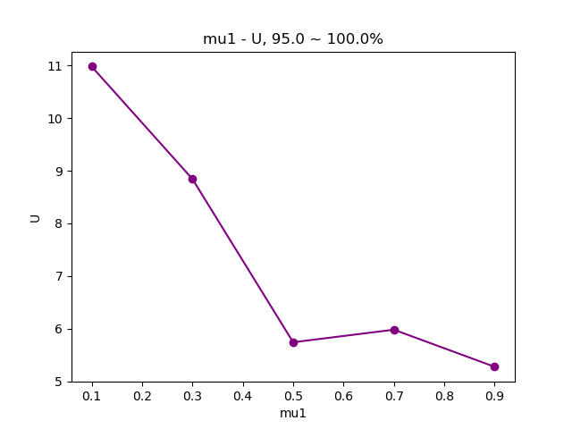
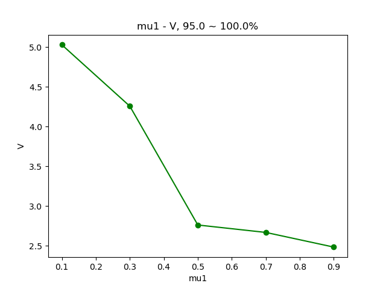
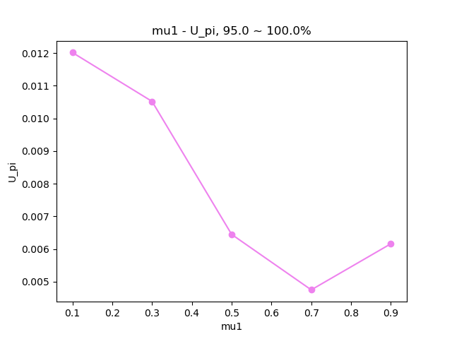
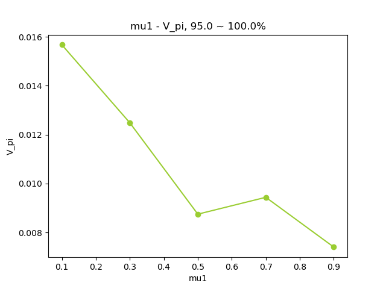

.. _test_var:

piegy.test_var
==============

This module contains tools to test the influence of one or two patch variables on the simulation results.

"Patch variables" denote the variables in P: mu1, mu2, w1, w2, kappa1, kappa2.

Test Functions
--------------

.. line-block::
    The two functions below perform tests on one or two patch variables and save data.
    Intended to combine with the plot functions in this module to visualize the results.

.. py:function:: test_var.test_var1(sim, var, values, dirs, compress_itv = 1, scale_maxtime = False, predict_runtime = True)

    .. line-block::
        Test the influence of one patch variable on simulation results. 
        
        ``test_var1`` makes copies of ``sim`` and changes the patch variable ``var`` to the specified values (in all patches), perform simulations, and then save data. The original ``sim`` is not changed. 

    :param sim: where the parameters of the model and data are stored. 
    :type sim: ``piegy.model.simulation`` object

    :param var: which variable to test. Expect a string of the variable name, such as ``'mu1'``, ``'kappa1'``.
    :type var: str

    :param values: what values of ``var`` to test.
    :type values: list or ``numpy.ndarray``

    :param dirs: where to save test data. Expect a path to a folder. ``test_var1`` then create subfolders inside ``dirs`` and store data.
    :type dirs: str

    :param compress_itv: used to reduce data size: takes average over every ``'compress_itv'`` many data points when saving. Passed to ``piegy.model.simulation.compress_data`` method.
    :type compress_itv: int

    :param scale_maxtime: whether to scale ``maxtime`` of tests towards the input ``sim``. Intended to avoid unnecessarily long runtime possibly encountered in tests due to different values.
    :type scale_maxtime: bool

    :param predict_runtime: whether to predict how long the tests still going to take. Passed to ``piegy.model.run`` function.

    :return: a list of directories where all test results are stored. One directory corresponds to one value of ``var``.
    :rtype: list of str

|

.. py:function:: test_var.test_var2(sim, var1, var2, values1, values2, dirs, compress_itv = 1, scale_maxtime = False, predict_runtime = True)

    .. line-block::
        Test the influence of two patch variables on simulation results.
        Note which variable comes first does make a difference when plotting: var2 will be placed on x-axis, while different values of var1 are represented by different curves.

        ``test_var2`` makes copies of ``sim`` and changes the patch variables ``var1`` and ``var2`` to the specified values (in all patches), perform simulations, and then save data. The original ``sim`` is not changed. 

    :param sim: where the parameters of the model and data are stored. 
    :type sim: ``piegy.model.simulation`` object

    :param var1: the first variable to test. Expect a string of the variable name, such as ``'mu1'``, ``'kappa1'``.
    :type var1: str

    :param var2: the second variable to test. 
    :type var2: str

    :param values1: what values of ``var1`` to test.
    :type values1: list or ``numpy.ndarray``

    :param values2: what values of ``var2`` to test.
    :type values2: list or ``numpy.ndarray``

    :param dirs: where to save test data. Expect path to a folder. ``test_var2`` then create subfolders inside ``dirs`` and store data.
    :type dirs: str

    :param compress_itv: used to reduce data size: takes average over every ``'compress_itv'`` many data points when saving. Passed to ``piegy.model.simulation.compress_data`` method.
    :type compress_itv: int

    :param scale_maxtime: whether to scale ``maxtime`` of tests towards the input ``sim``. Intended to avoid unnecessarily long runtime possibly encountered in tests due to different values.
    :type scale_maxtime: bool

    :param predict_runtime: whether to predict how long the tests still going to take. Passed to ``piegy.model.run`` function.

    :return: a 2D list of directories where all test results are stored. One directory corresponds to one pair of ``var1`` value and ``var2`` value.
    :rtype: 2D list of str

|

Plot Functions
--------------

The following functions help to visualize simulation results.

.. py:function:: test_var.var_UV1(var, values, var_dirs, start = 0.95, end = 1.0, U_color = 'purple', V_color = 'green')

    .. line-block::
        Plots how U, V average population over a specified time interval change with different values of a patch variable.

    :param var: which patch variable you tested. Expect a string of the variable name, such as ``'mu1'``, ``'kappa1'``.
    :type var: str

    :param values: what values you tested with.
    :type values: list or ``numpy.ndarray``

    :param var_dirs: where test results are stored. Expect the return value of ``piegy.test_var.test_var1``. 
                    You can get a copy of it by ``piegy.test_var.get_dirs1`` if lost. Data not existing are ignored.
    :type var_dirs: list of str

    :param start: lower bound of the time interval to plot.
    :type start: float

    :param end: upper bound of the time interval to plot. For details of ``start`` and ``end``, see :ref:`Clarifications-start_end<start_end>`.
    :type end: float

    :return: two figures of how U, V population change with values of ``var``
    :rtype: ``matplotlib`` figures.

|

.. py:function:: test_var.var_UV2(var1, var2, values1, values2, var_dirs, start = 0.95, end = 1.0, U_color = 'viridis', V_color = 'viridis', rgb_alpha = 1)

    .. line-block::
        Plot how U, V average population over a specified time interval change with different values of two patch variables.
        ``var2`` values are shown on the x-axis; ``var1`` values are shown by different curves.
    
    :param var1: the first patch variable you tested. Expect a string of the variable name, such as ``'mu1'``, ``'kappa1'``.
    :type var1: str

    :param var2: the second patch variable you tested.
    :type var2: str

    :param values1: what values for ``var1`` you tested.
    :type values1: list or ``numpy.ndarray``

    :param values2: what values for ``var2`` you tested.
    :type values2: list or ``numpy.ndarray``

    :param var_dirs: where test results are stored. Expect the return value of ``piegy.test_var.test_var2``. 
                    You can get a copy of it by ``piegy.test_var.get_dirs2`` if lost. Data not existing are ignored.
    :type var_dirs: double list of str

    :param start: lower bound of the time interval to plot.
    :type start: float

    :param end: upper bound of the time interval to plot. For details of ``start`` and ``end``, see :ref:`Clarifications-start_end<start_end>`.
    :type end: float

    :param color: used to set gradient colors for the curves in plots. Expect name of a matplotlib color map.
    :type color: str

    :param rgb_alpha: alpha value in rgb. Used to make points semi-transarent if overlapping.
    :type rgb_alpha: float

    :return: two figures of how U, V payoff change with values of ``var1`` and ``var2``
    :rtype: ``matplotlib`` figures.

|

.. py:function:: test_var.var_pi1(var, values, var_dirs, start = 0.95, end = 1.0, U_color = 'violet', V_color  = 'yellowgreen')

    .. line-block::
        Plots how U, V average payoff over a specified time interval change with different values of a patch variable.

    :param var: which patch variable you tested. Expect a string of the variable name, such as ``'mu1'``, ``'kappa1'``.
    :type var: str

    :param values: what values you tested with.
    :type values: list or ``numpy.ndarray``

    :param var_dirs: where test results are stored. Expect the return value of ``piegy.test_var.test_var1``. 
                    You can get a copy of it by ``piegy.test_var.get_dirs1`` if lost. Data not existing are ignored.
    :type var_dirs: list of str

    :param start: lower bound of the time interval to plot.
    :type start: float

    :param end: upper bound of the time interval to plot. For details of ``start`` and ``end``, see :ref:`Clarifications-start_end<start_end>`.
    :type end: float

    :return: two figures of how U, V payoff change with values of ``var``
    :rtype: ``matplotlib`` figures.

|

.. py:function:: test_var.var_pi2(var1, var2, values1, values2, var_dirs, start = 0.95, end = 1.0, U_color = 'viridis', V_color = 'viridis', rgb_alpha = 1)

    .. line-block::
        Plot how U, V average payoff over a specified time interval change with different values of two patch variables.
        ``var2`` values are shown on the x-axis; ``var1`` values are shown by different curves.
    
    :param var1: the first patch variable you tested. Expect a string of the variable name, such as ``'mu1'``, ``'kappa1'``.
    :type var1: str

    :param var2: the second patch variable you tested.
    :type var2: str

    :param values1: what values for ``var1`` you tested.
    :type values1: list or ``numpy.ndarray``

    :param values2: what values for ``var2`` you tested.
    :type values2: list or ``numpy.ndarray``

    :param var_dirs: where test results are stored. Expect the return value of ``piegy.test_var.test_var2``. 
                    You can get a copy of it by ``piegy.test_var.get_dirs2`` if lost. Data not existing are ignored.
    :type var_dirs: double list of str

    :param start: lower bound of the time interval to plot.
    :type start: float

    :param end: upper bound of the time interval to plot. For details of ``start`` and ``end``, see :ref:`Clarifications-start_end<start_end>`.
    :type end: float

    :param color: used to set gradient colors for the curves in plots. Expect name of a matplotlib color map.
    :type color: str

    :param rgb_alpha: alpha value in rgb. Used to make points semi-transarent if overlapping.
    :type rgb_alpha: float

    :return: two figures of how U, V payoff change with values of ``var1`` and ``var2``
    :rtype: ``matplotlib`` figures.

|

Other Functions
---------------

Other useful functions. 

.. py:function:: test_var.var_convergence1(var_dirs, interval = 20, start = 0.75, fluc = 0.05)

    .. line-block::
        Check whether the test results converge, used when just one variable is tested. This function calls ``check_convergence`` function in ``piegy.model_analysis``.
        Please use ``piegy.test_var.var_convergence2`` to check convergence when testing two vairables.

    :param var_dirs: where all test results are stored. Expect the return value of ``piegy.test_var.test_var1``. 
                    You can get a copy of it by ``piegy.test_var.get_dirs1`` if lost. Data not existing are ignored.
    :type var_dirs: double list of str

    :param interval: takes average over some number of data points to smooth data.
    :type interval: int

    :param start: defines a time point. Calculate fluctuation of U, V population after this point.
    :type start: float

    :param fluc: threshold of fluctuation. Check whether max fluctuation of U, V population after ``start`` proportion of time is less than this threshold.
    :type fluc: float

    :return: a list of directories where the data didn't converge.
    :rtype: list of str

|

.. py:function:: test_var.var_convergence2(var_dirs, interval = 20, start = 0.75, fluc = 0.05)

    .. line-block::
        Check whether the test results converge, used when just one variable is tested. This function calls ``check_convergence`` function in ``piegy.model_analysis``.
        Please use ``piegy.test_var.var_convergence2`` to check convergence when testing two vairables.

    :param var_dirs: where all test results are stored. Expect the return value of ``piegy.test_var.test_var2``. 
                    You can get a copy of it by ``piegy.test_var.get_dirs2`` if lost. Data not existing are ignored.
    :type var_dirs: double list of str

    :param interval: takes average over some number of data points to smooth data.
    :type interval: int

    :param start: defines a time point. Calculate fluctuation of U, V population after this point.
    :type start: float

    :param fluc: threshold of fluctuation. Check whether max fluctuation of U, V population after ``start`` proportion of time is less than this threshold.
    :type fluc: float

    :return: a list of directories where the data didn't converge.
    :rtype: list of str

|

.. py:function:: test_var.get_dirs1(var, values, dirs)

    .. line-block::
        Mimics the format of how ``piegy.test_var.test_var1`` creates directories and return a copy of its return value.
        Used to retrieve the directories of data.

    :param var: the patch variable you tested.
    :type var1: str

    :param values1: what values for ``var`` you tested.
    :type values1: list or ``numpy.ndarray``

    :param dirs: the path of directory which you passed to ``test_var1`` (or a new path if you re-named or moved it).
    :type dirs: str

    :return: a list of where ``piegy.test_var.test_var1`` saved data.
    :rtype: list of str

|

.. py:function:: test_var.get_dirs2(var1, var2, values1, values2, dirs)

    .. line-block::
        Mimics the format of how ``piegy.test_var.test_var2`` creates directories and return a copy of its return value.
        Used to retrieve the directories of data.

    :param var1: the first patch variable you tested.
    :type var1: str

    :param var2: the second patch variable you tested.
    :type var2: str

    :param values1: what values for ``var1`` you tested.
    :type values1: list or ``numpy.ndarray``

    :param values2: what values for ``var2`` you tested.
    :type values2: list or ``numpy.ndarray``

    :param dirs: the path of directory which you passed to ``test_var2`` (or a new path if you re-named or moved it).
    :type dirs: str

    :return: a double list of where ``piegy.test_var.test_var2`` saved data.
    :rtype: double list of str

|

Examples
-----------

The ``piegy.test_var`` module provided several handy tools to test how patch vairables influence simulation results, either population or payoff.

First please import necessary modules:

.. code-block:: python

    import piegy.model as model
    import piegy.test_var as test_var

We will use our classical demo model. You can obtain a copy by ``piegy.model.demo_model``:

.. code-block:: python

    sim = model.demo_model()

If we run this demo model directly, The equilibrium U, V population is around 5.7 and 2.7 per patch. (For model parameters and simulation results, see :ref:`Typical Params<Typical_Params>`)

You might be wondering, would change of patch variables influence equilibrium population? 
If we keep all other parameters the same and change the value of just one patch variable, will the equilibrium population and payoff be different?

Great question! This is exactly what this module is made for: test infleunce of one or two patch variables on simulation results. Let's see how to use it.

Say you want to test the ``mu1`` variable on a few values ``[0.1, 0.3, 0.5, 0.7, 0.9]``:

.. code-block:: python

    var = 'mu1'
    values = [0.1, 0.3, 0.5, 0.7, 0.9]

These will be the first two required arguments. The third one is path to a directory: we need some place to store the data.

.. code-block:: python

    dirs = 'some_dirs'

Then you can call ``piegy.test_var.test_var1`` to test how the above values for ``w1`` influence population and payoff. 

.. code-block:: python

    var_dirs = test_var.test_var1(var, values, dirs)

The return value ``var_dirs`` is a list of directories where data are stored. It is structured in a certain format and tells other functions where to find data.
If you print ``var_dirs``, it looks like:

.. code-block:: python

    print(var_dirs)

Output:

.. code-block:: text

    ['some_dirs/mu1=0.1', 'some_dirs/mu1=0.3', 'some_dirs/mu1=0.5', 
     'some_dirs/mu1=0.7', 'some_dirs/mu1=0.9']

There are many ways to analyze data, you can either use the figure functions in ``piegy.figures``, implement your own methods, ... 
But ``piegy.test_var`` module does provide several handy tools. For example, let's try ``test_var.var_UV1``:

.. code-block:: python

    mu1_U, mu1_V = test_var.var_UV1(var, values, dirs)

This function plots how U, V equilibrium population change with values of ``mu1``:

    Change of U Population with ``mu1``

    Change of V Population with ``mu1``

You can also plot change of payoff by ``test_var.var_pi1``:

.. code-block:: python

    mu1_Upi, mu1_Vpi = test_var.var_pi1(var, values, dirs)

    Change of U Payoff with ``mu1``

    Change of V Payoff with ``mu1``

We observe a roughly decreasing trend here: larger ``mu1`` value tends to decrease population and payoff. 
It's also noteworthy that our demo model ``sim`` runs the simulation only once: ``sim.sim_time = 1``. 
So the figures above are probably far from accurate. If we set ``sim.sim_time`` to 20 and try more values of ``mu1``, we could see a clearer trend.

Note all the plot functions above requires ``var_dirs`` (return value of ``test_var.var_UV1``): it tells the functions where to find data. 
If you want to read from an old set of ``test_var1`` data but don't have the old ``var_dirs`` anymore, you can remake it by ``test_var.get_dirs1`` function. 

``test_var.get_dirs1`` automatically makes ``var_dirs`` based on what variable, values and the "base directory" ``dirs`` you used. 
You can also pass in more a larger list of ``values`` if you ran more tests afterwards.

.. code-block:: python

    var_dirs_remade = test_var.get_dirs1(var, values, dirs)

``var_dirs_remade`` will be the same as the original ``var_dirs``. You can pass it to the plot functions above.

|

So far we have introduced most of the ``test_var`` functions for the 1-variable tests. You can also perform 2-variable tests with the counterparts of these functions; the usage is very similar.

