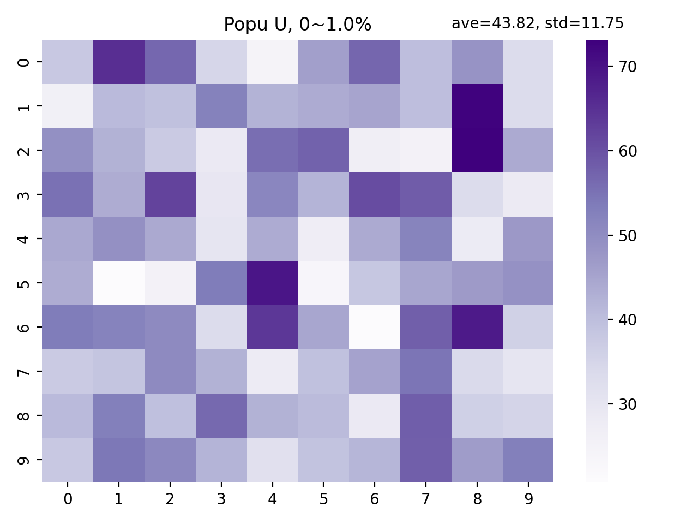
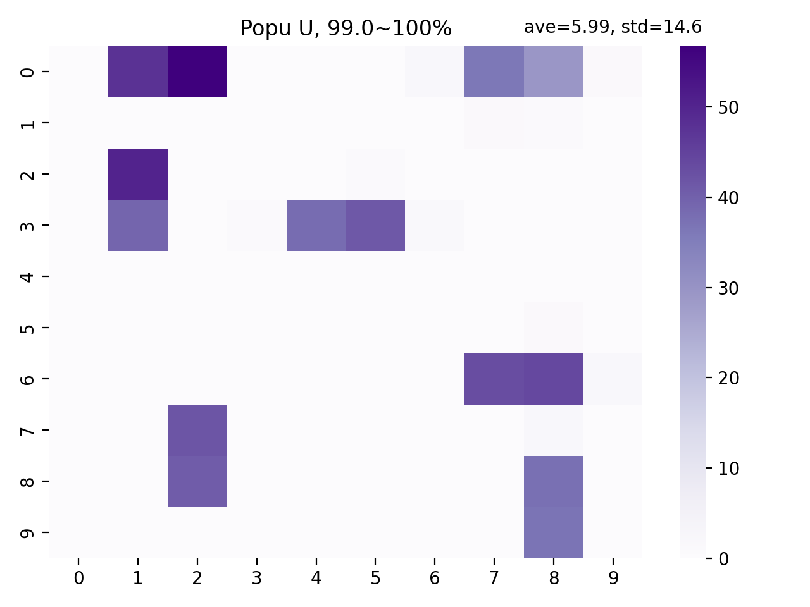

.. _videos:

piegy.videos
=================

Ths ``piegy.videos`` module is intended to reveal how some values or distribution change over time, which is hard to show in 2D figures.

Videos are made based on our figure functions, see :ref:`figures`.
However, not all figure functions are suited for making videos, such as ``peigy.figures.UV_dyna``: it already reveals the population dynamics.

A list of supported functions is also in this given in ``videos.SUPPORTED_FIGURES``.

.. data:: videos.SUPPORTED_FIGURES

    :type: list of str

    .. line-block::
        A list of valid keywords to pass to ``piegy.videos.make_video``. Every keyword is mapped to a function of ``piegy.figures`` and used to make frames.

        Elements:
        ``'UV_heatmap'`` - mapped to ``piegy.figures.UV_heatmap``
        ``'pi_heatmap'`` - mapped to ``piegy.figures.pi_heatmap``
        ``'UV_bar'`` - mapped to ``piegy.figures.UV_bar``
        ``'pi_bar'`` - mapped to ``piegy.figures.pi_bar``
        ``'UV_hist'`` - mapped to ``piegy.figures.UV_hist``
        ``'pi_hist'`` - mapped to ``piegy.figures.pi_hist``
        ``'UV_pi'`` - mapped to ``piegy.figures.UV_pi``

|

.. py:function:: videos.make_video(mod, func_name = 'UV_heatmap', frames = 100, dpi = 200, fps = 30, U_color = 'Greens', V_color = 'Purples', annot = False, fmt = '.3g', del_frames = False, dirs = 'videos')
    
    Makes video to show how some values or distribution change over time. No return value.

    :param mod: where the parameters of the model and data are stored. 
    :type mod: ``piegy.simulation.model`` object

    :param func_name: the name of figures function to use (to make frames). Valid names and corresponding functions are listed in ``piegy.videos.SUPPORTED_FIGURES``
    :type func_name: str

    :param frames: the number of frames to make. More frames generate smoother videos.
    :type frames: int

    :param dpi: dots per inch in each frame.
    :type dpi: int

    :param fps: frames per second.
    :type fps: int

    :param U_color: color for U's video. Can be either matplotlib color maps or regular colors, depending on whether you are making heatmap videos or not.
        If ``'heatmap'`` is in ``func_name``, please use color maps. Otherwise use regular colors.
    :type U_color: str

    :param V_color: similar to ``U_color``.
    :type V_color: str

    :param del_frames: whether to delete frames after videos are made.
    :type del_frames: bool

    :param dirs: where to store the videos and frames, should be a path of a folder.
    :type dirs: str

|

Examples
-----------

Here we provide some usage examples for the ``piegy.videos`` module.

First let's import some necessary modules:

.. code-block:: python

    from piegy import simulation, videos

We will use our :ref:`demo model<Demo_Params>`. You can get a copy by ``piegy.simulation.demo_model``:

.. code-block:: python

    mod = simulation.demo_model()
    simulation.run(mod)

In this demo model, we started from a uniform population distribution and arrived at a rather clustered distribution. 
For example, the following are the U average distribution at start and end of simulation:

    Average U distribution in the start, 0% ~ 1% of ``maxtime``

    Average U distribution in the end, 99% ~ 100% of ``maxtime``

We can visualize the change in between by videos. Call ``piegy.videos.make_video``:

.. code-block:: python

    make_video(mod)

We make videos in a naive approach: first make frames, and then put frames together into videos.
The videos will be saved at ``'videos'`` directory. You can specify a location using ``dirs`` parameter.

Additionally, you can also make other types of videos, such as correlation between population and payoff, by the ``func_name`` parameter.
See the ``make_video`` function description above for detailed explanation of all parameters.
